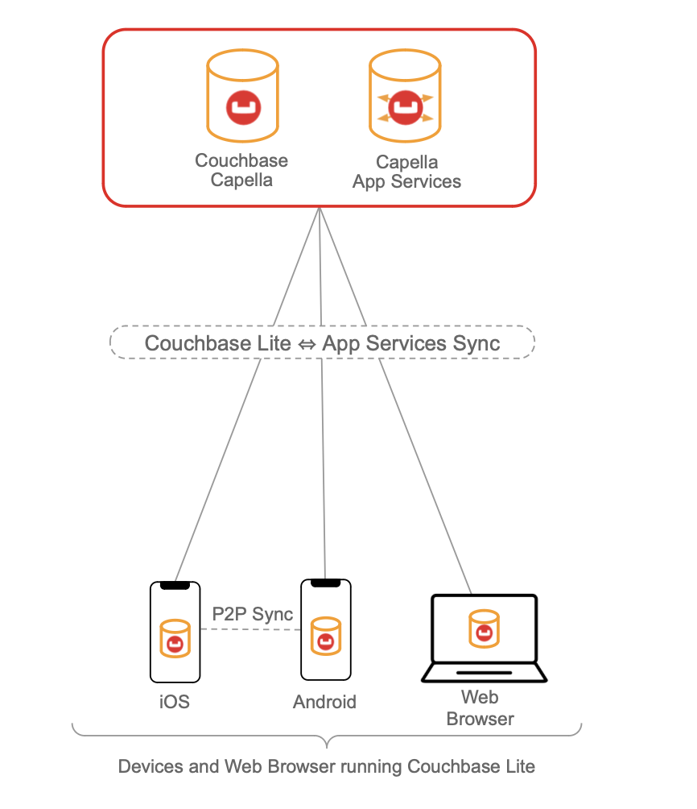
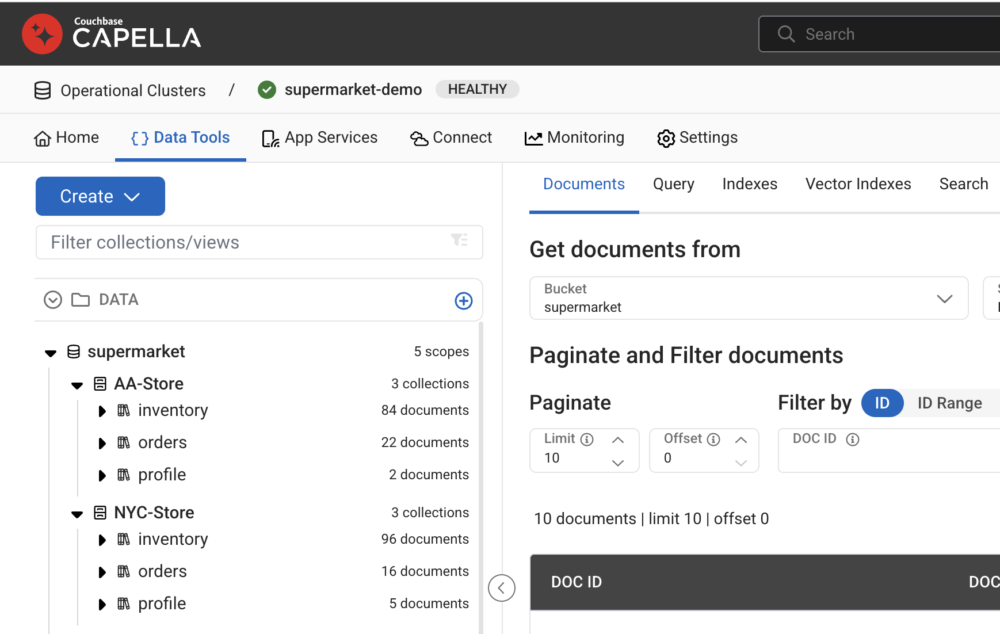
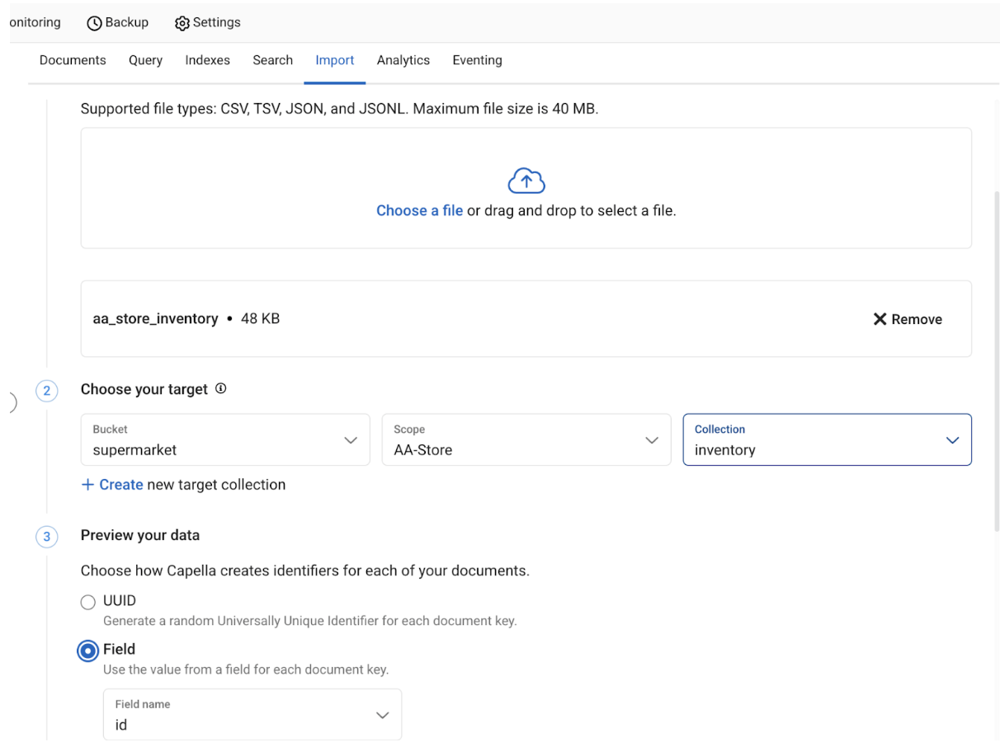
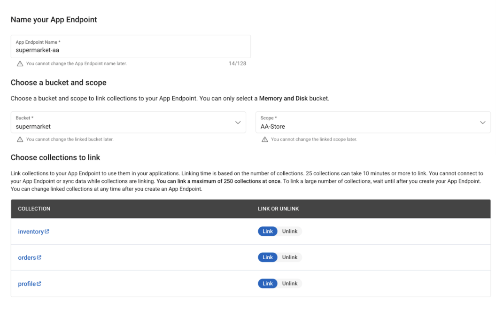
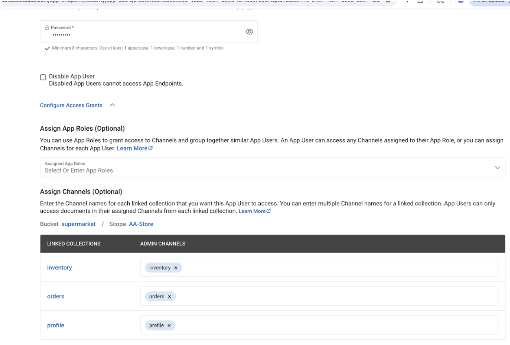
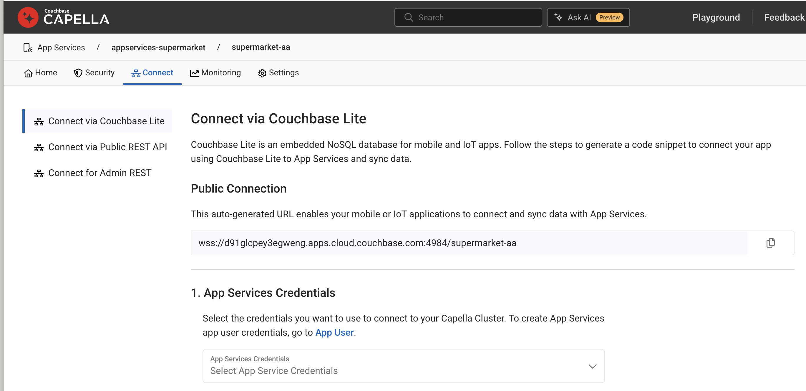
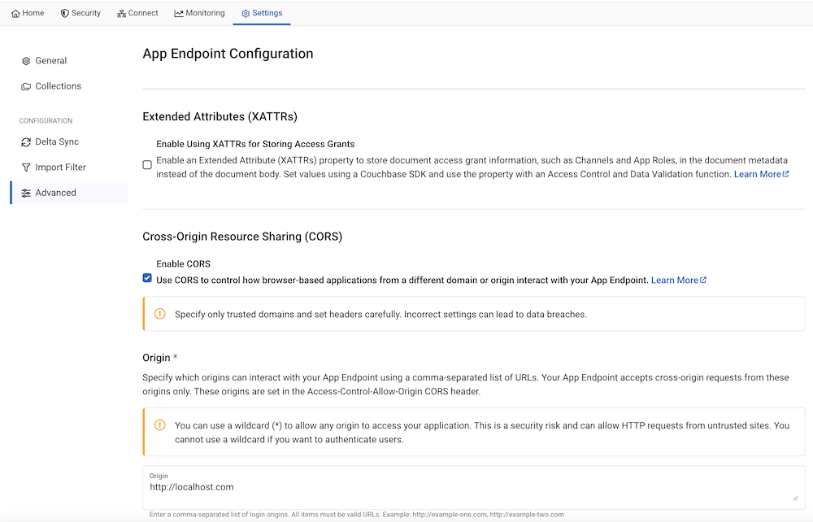
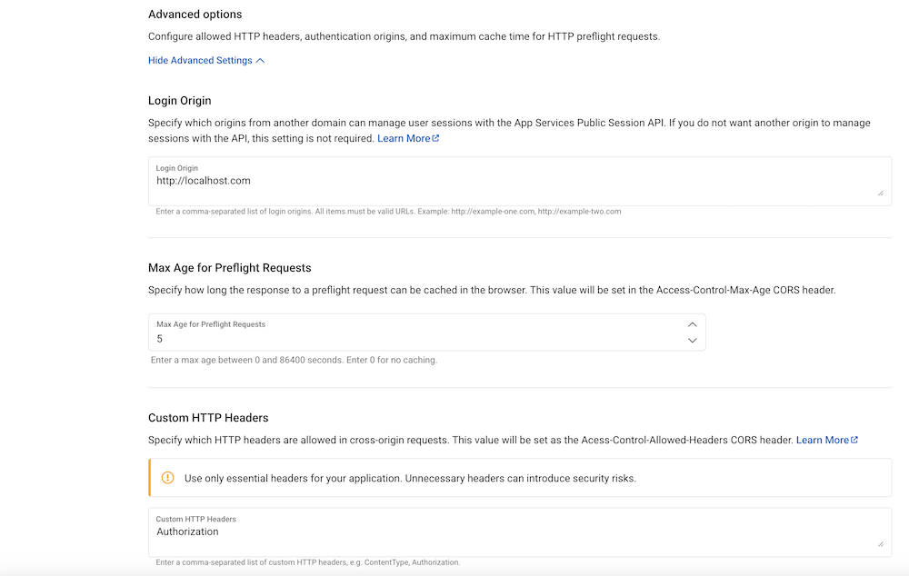

# Couchbase Mobile Retail Demo Application

A retail inventory management application built with [Couchbase Lite](https://docs.couchbase.com/couchbase-lite/current/index.html) for web and mobile (iOS, Android, and React Native), featuring real-time sync with [Couchbase Capella App Services](https://docs.couchbase.com/cloud/app-services/deployment/creating-an-app-service.html).


## Demo App Features

- 📱 **Offline-First**: Operates fully without an internet connection. Couchbase Lite stores all data locally, and changes sync automatically when connectivity is restored.
- 🔄 **Real-Time Sync**: Bidirectional sync with Couchbase Capella via App Services. Changes appear instantly across iOS, Android, React Native, and web.
- 🔄 **Peer-to-Peer Sync**: Sync data directly between iOS and Android devices over a local network, without going through the cloud.
- 🏪 **Multi-Platform Support**: A single backend supports **[iOS](https://docs.couchbase.com/couchbase-lite/current/swift/quickstart.html)**, **[Android](https://docs.couchbase.com/couchbase-lite/current/android/quickstart.html)**, **[React Native](https://www.npmjs.com/package/cbl-reactnative)**, and **[Web](https://docs.couchbase.com/couchbase-lite-javascript/current/index.html)**. Couchbase Lite also supports C, Java, .NET, Ionic, Flutter, and more.

## Demo Video

### Peer-to-Peer Sync across iOS and Android

A demo video where we are able to sync data between two android devices and an iPhone with CouchbaseLite's P2P.

https://github.com/user-attachments/assets/eec4bbed-5fa3-4b55-8b07-f4df01574c33

### Real time Data Sync via Capella App Services

https://github.com/user-attachments/assets/781028cf-6f67-4ad9-abd5-a52daf4c83d6

https://github.com/user-attachments/assets/72f61f2b-118f-4bc6-8f43-30dfac6e8f5e

## New to Couchbase? Start Here

If you've never worked with Couchbase before, read this section first. It explains what this demo is doing and why, so the setup instructions will make sense.

**Couchbase Lite** is an embedded NoSQL database that runs directly inside a mobile or web app, similar to SQLite, but built for sync. It stores data locally so the app works even with no internet connection.

**Capella App Services** is the cloud sync layer. It sits between the app and a Couchbase Capella cloud cluster, routing data changes between all connected devices in real time. When a device comes back online after being offline, it automatically syncs any changes it missed.

This demo simulates two supermarket stores, an Ann Arbor store and a NYC store, each running the same app on different devices. Inventory, orders, and store profiles sync to a shared cloud cluster via App Services, so a change on one device appears on all others.

```
[Mobile / Web App]
       ↕  (local reads & writes; works fully offline)
[Couchbase Lite: embedded on-device database]
       ↕  (WebSocket replication when online)
[Capella App Services: cloud sync gateway]
       ↕
[Couchbase Capella: cloud database cluster]
```

## Key Concepts

These terms appear throughout the setup instructions and individual app READMEs. Read this once and the rest will make sense.

| Term | What it means |
|------|---------------|
| **Couchbase Lite** | The embedded database library inside each app. All data is saved here first. Works offline. |
| **Capella** | Couchbase's managed cloud database platform, the cloud backend where all device data lands. |
| **App Services** | A layer on top of Capella that handles sync, authentication, and access control for mobile/web clients. Your app connects to an App Services *endpoint URL*, not directly to the database. |
| **Bucket** | Top-level data container in Capella (like a database). This demo uses a bucket named `supermarket`. |
| **Scope** | A namespace inside a bucket (like a schema in SQL). This demo has two: `AA-Store` (Ann Arbor) and `NYC-Store`. |
| **Collection** | A group of JSON documents inside a scope (like a table in SQL). Each scope has three: `inventory`, `orders`, `profile`. |
| **Replicator** | The sync engine built into Couchbase Lite. Runs in the background and continuously pushes local changes to App Services and pulls remote changes down. |
| **App Endpoint** | A named entry point in App Services that maps to a specific scope. Apps connect to an endpoint (e.g., `supermarket-nyc`) rather than directly to the bucket. |
| **App User** | A credential registered in App Services. The app authenticates with a username/password to access a specific endpoint. |
| **Continuous Replication** | A mode where the replicator keeps a persistent WebSocket connection open and syncs changes immediately in both directions, rather than on a schedule. |

## Demo Setup

The complete setup of the demo would look like this:



> [!NOTE]
> You are not required to go through the entire setup. Depending on the app and functionality of interest, you can proceed with just the setup required for just that app and functionality.

## Setting up Capella Cluster

These are common set of instructions that you must follow to setup the cloud backend regardless of whether you are running iOS, Android and web versions of the app.

Although instructions are specified for Capella App Services, equivalent instructions apply to self-managed Sync Gateway as well.

- Create a couchbase cluster on Capella by following these [instructions](https://docs.couchbase.com/cloud/get-started/create-account.html).

### Deploy App Service (do this early — it takes 5–25 minutes)

> [!TIP]
> App Service deployments can take between 5 and 25 minutes. Start the deployment now so it can provision in the background while you set up the bucket, scopes, collections, and sample data in the steps that follow.

- Create an App Service named **"supermarket-appservice"** (you can name it anything) that is linked to the cluster you just created by following these [instructions](https://docs.couchbase.com/cloud/get-started/create-account.html#app-services)

### Create Bucket, Scopes and Collections

> [!NOTE]
> The Capella UI only lets you create **one** scope and **one** collection at the time of bucket creation. The remaining scope and collections must be added afterwards. The steps below reflect that flow.

1. **Create the bucket with its first scope and collection.** Follow these [instructions](https://docs.couchbase.com/cloud/clusters/data-service/about-buckets-scopes-collections.html#buckets) and, on the bucket-creation screen, fill in:
   - **Bucket name**: `supermarket`
   - **Scope name**: `NYC-Store`
   - **Collection name**: `inventory`

2. **Add the second scope.** In the `supermarket` bucket, add a new scope named `AA-Store` by following these [instructions](https://docs.couchbase.com/cloud/clusters/data-service/about-buckets-scopes-collections.html#scopes).

3. **Add the remaining collections.** Using these [instructions](https://docs.couchbase.com/cloud/clusters/data-service/scopes-collections.html#create-collection), add collections so each scope ends up with **`inventory`**, **`profile`**, and **`orders`**:
   - In **`NYC-Store`**: add `profile` and `orders` (the `inventory` collection already exists from step 1).
   - In **`AA-Store`**: add `inventory`, `profile`, and `orders`.

At the end of these steps, your cluster configuration should look something like . You have probably not yet imported any data, so your collections will show no documents.

## Importing Sample Data Set

- Download and unzip sample dataset from [demo-dataset.zip](https://cbm-retaildemo-dataset.s3.us-west-1.amazonaws.com/demo-dataset.zip)

- Follow [instructions](https://docs.couchbase.com/cloud/clusters/data-service/import-data-documents.html#how-to-import-data) to import the data set into corresponding scope/collection via inline mode.

> [!NOTE]
>  When importing data, Select the Field option to map doc Id.



## Configuring Capella App Services

By now your App Service deployment (started earlier) should be ready or close to ready.

- Create two App Endpoints corresponding to the two scopes. This is an example for AA store. Name App Endpoints as **"supermarket-aa"** and **"supermarket-nyc"** by following these [instructions](https://docs.couchbase.com/cloud/get-started/configuring-app-services.html#create-app-endpoint).

The configuration of App Endpoint should look like this:


- Configure two App Users corresponding to the two stores (one in each App Endpoint) by following these [instructions](https://docs.couchbase.com/cloud/app-services/user-management/create-user.html).You can choose any password. If you would like to run the app with prefilled demo credentials, you must use the password mentioned below. This will make more sense when you setup the individual apps later.
   - **user**=nyc-store-01@supermarket.com / **password**=P@ssword1 (this is created in App Endpoint supermarket-nyc)
   - **user**=aa-store-01@supermarket.com / **password**=P@ssword1 (this is created App Endpoint supermarket-aa)

The configuration of App User should look something like this:


- Go to the "connect" tab and record the public URL endpoint. You will need it when you setup your apps later



### CORS Setup for Web Applications

If you are trying out the web application, you will need to configure App Endpoints to enable CORS. Skip this section if you are only testing mobile apps.
Repeat these steps for each of the App Endpoints

- Enable CORS on your App Endpoint from the Settings Page by following these [instructions](https://docs.couchbase.com/cloud/app-services/deployment/cors-configuration-for-app-services.html#about-cors-configuration)
  
- Set **Origin** as "http://localhost:8080". This corresponds to the URL that is running the web app. Make sure the ports match as well
  

- Set **Login Origin** as "http://localhost:8080". This corresponds to the URL that is running the web app. Make sure the ports match as well

- Set **Allowed Headers** as "Authorization". This corresponds to the URL that is running the web app. Make sure the ports match as well
  


## Repo Structure

The repo is organized as follows:

- **iOS**: Swift/SwiftUI app for iPhone and iPad. Supports cloud sync and peer-to-peer sync. Follow the [iOS README](./iOS/README.md) to build and run.

- **Android**: Kotlin/Jetpack Compose app for Android. Supports cloud sync and peer-to-peer sync. Follow the [Android README](./Android/README.md) to build and run.

- **react-native**: Cross-platform app built with React Native (Expo) that runs on both iOS and Android from a single codebase. Supports cloud sync. Follow the [React Native README](./react-native/README.md) to build and run.

- **web**: Browser-based app built with React and TypeScript. Supports cloud sync. Follow the [Web README](./web/README.md) to build and run.

All four apps connect to the same Capella backend, so you can mix platforms and watch data sync across them in real time.
