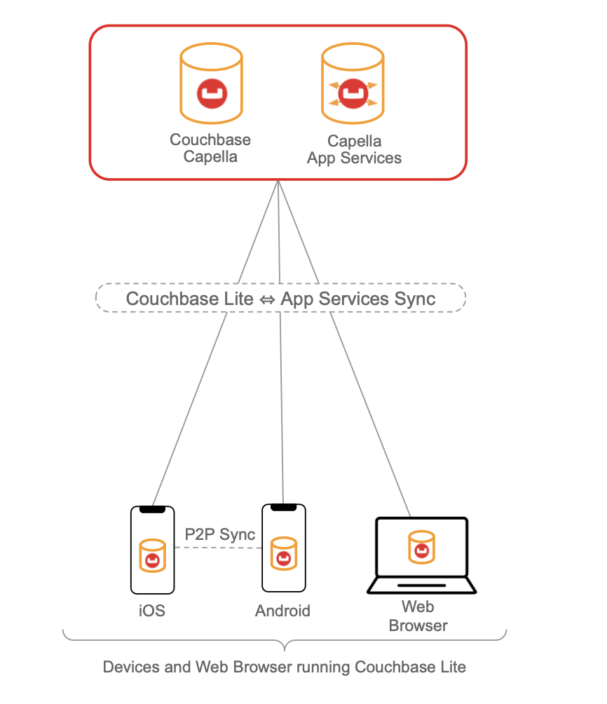
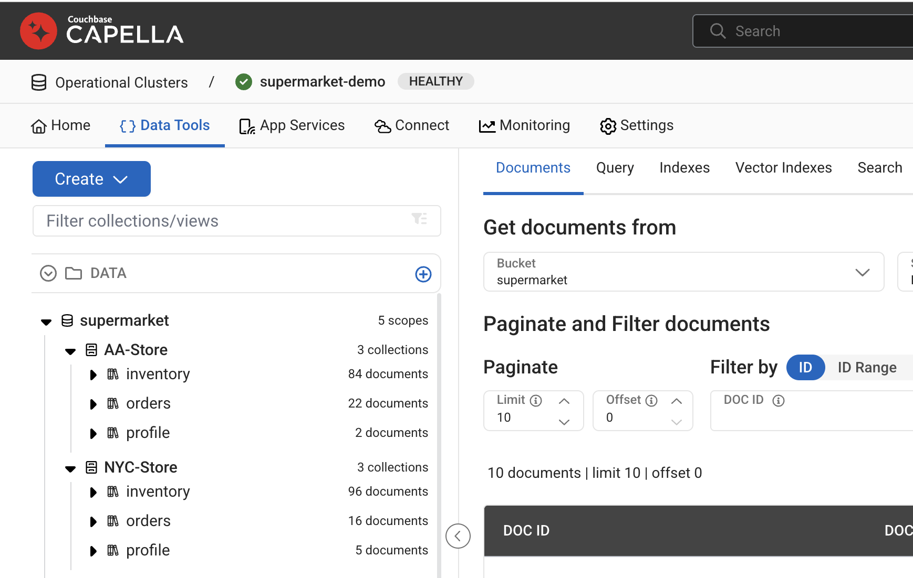
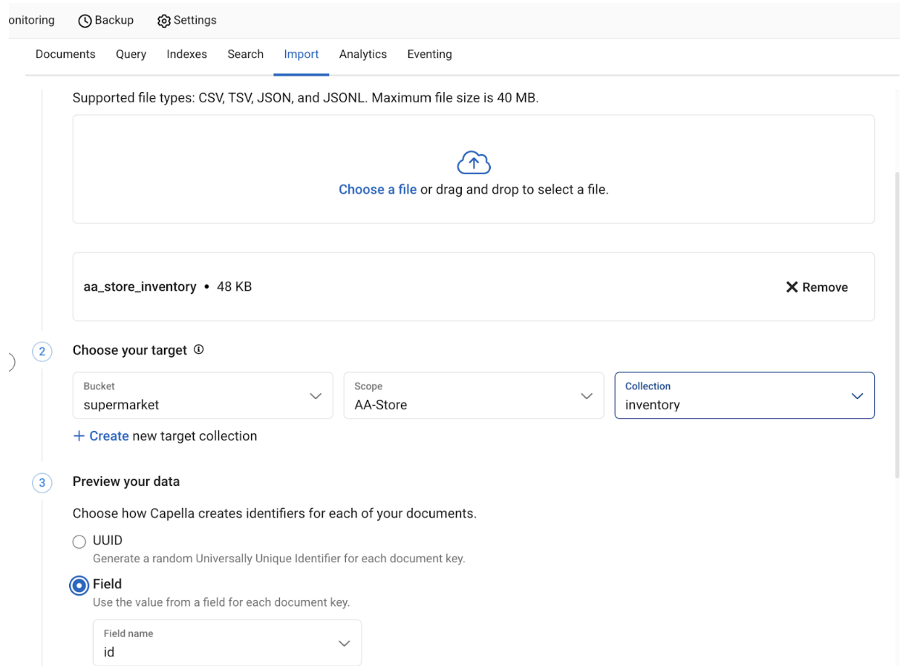
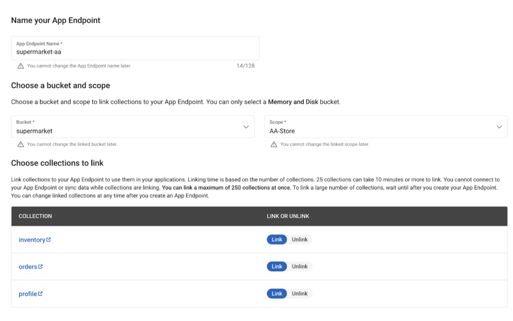
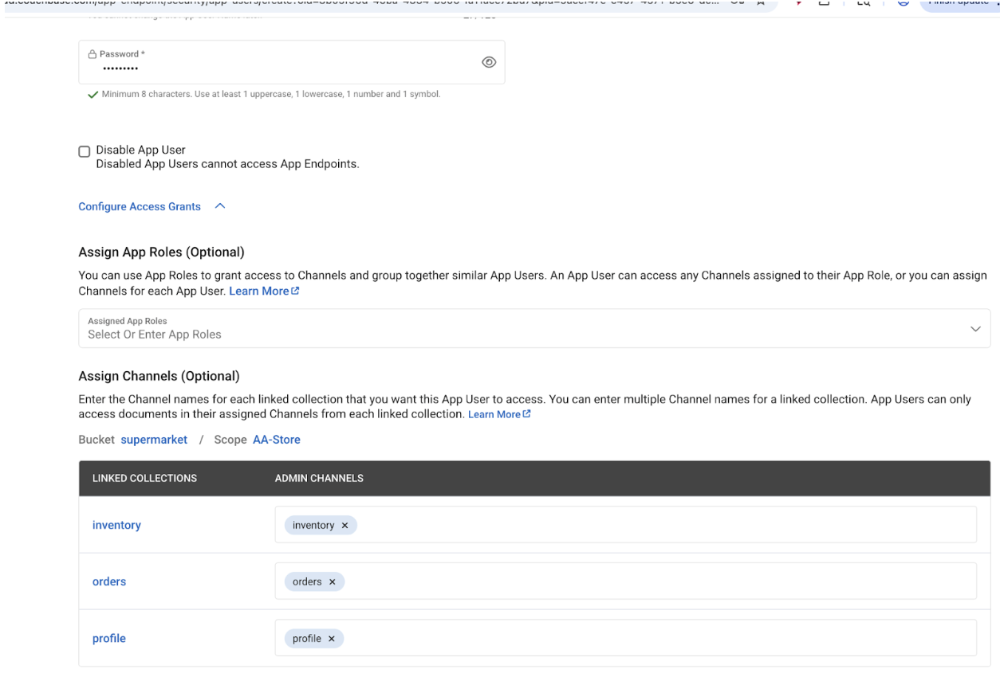
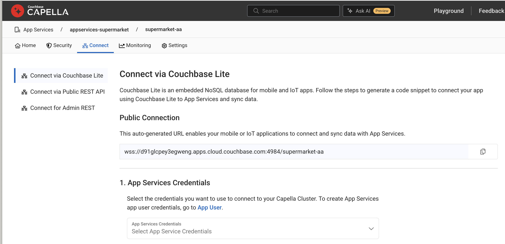
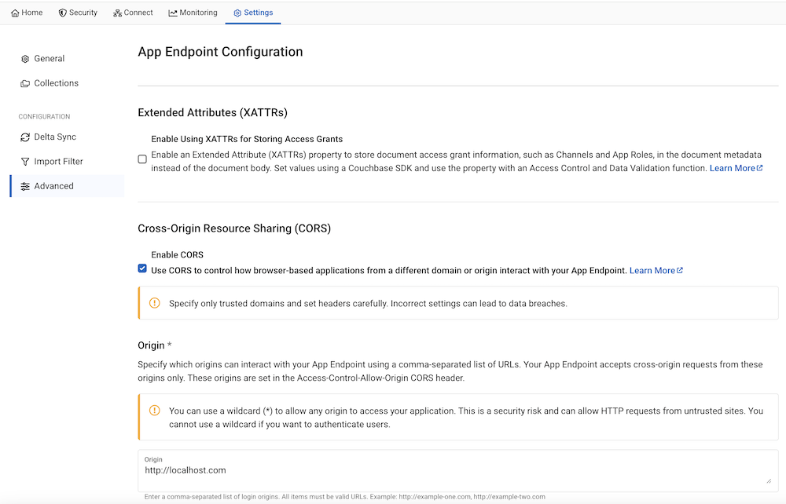
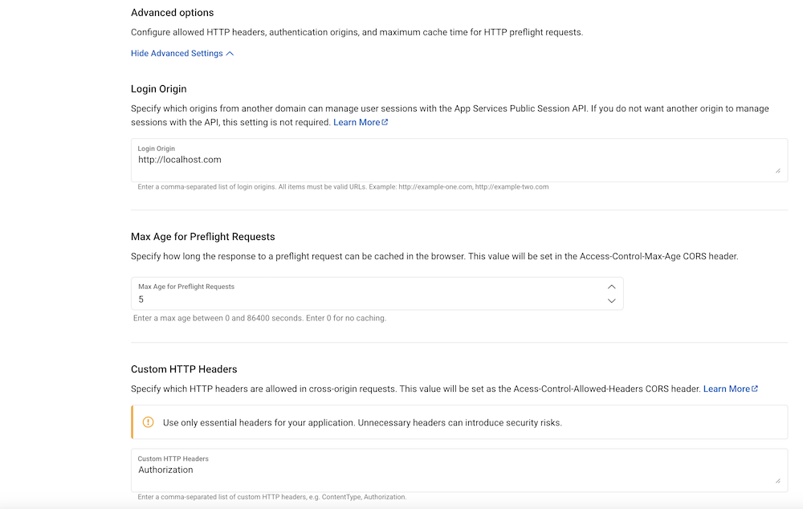

# Couchbase Mobile Retail Demo Application

A retail inventory management application built with [Couchbase Lite](https://docs.couchbase.com/couchbase-lite/current/index.html) for web and mobile (iOS, Android, and React Native), featuring real-time sync with [Couchbase Capella App Services](https://docs.couchbase.com/cloud/app-services/deployment/creating-an-app-service.html).


## Demo App Features

- 📱 **Offline-First**: Operates fully without an internet connection. Couchbase Lite stores all data locally, and changes sync automatically when connectivity is restored.
- 🔄 **Real-Time Sync**: Bidirectional sync with Couchbase Capella via App Services. Changes appear instantly across iOS, Android, React Native, and web.
- 🔄 **Peer-to-Peer Sync**: Sync data directly between iOS and Android devices over Wi-Fi or Bluetooth LE, without going through the cloud. Devices auto-mesh and fall back to Bluetooth when no shared Wi-Fi network is available.
- 🔍 **On-Device Vector Search**: Semantic product search, a visual shelf audit, and retrieval augmented answers, all running against the local database with no cloud inference. iOS and Android only. See [the Copilot](./docs/copilot.md).
- 🏪 **Multi-Platform Support**: A single backend supports **[iOS](https://docs.couchbase.com/couchbase-lite/current/swift/quickstart.html)**, **[Android](https://docs.couchbase.com/couchbase-lite/current/android/quickstart.html)**, **[React Native](https://www.npmjs.com/package/cbl-reactnative)**, and **[Web](https://docs.couchbase.com/couchbase-lite-javascript/current/index.html)**. Couchbase Lite also supports C, Java, .NET, Ionic, Flutter, and more.

## Demo Video

### On-Device Vector Search (Store Associate Copilot)

A walkthrough of the Copilot tab on iPhone: finding products by describing them, checking a shelf against its planogram, and answering a shopper's question from the store's own product knowledge. Every search runs on the phone against the local Couchbase Lite database, and the video ends in airplane mode to show it all still works offline. See [The Store Associate Copilot](#the-store-associate-copilot) below for what each feature does.

<!-- VIDEO: drag and drop the vector search demo video on the blank line below -->


### Peer-to-Peer Sync across iOS and Android

A demo video where we are able to sync data between two android devices and an iPhone with CouchbaseLite's P2P. The replicator meshes over Wi-Fi when available and automatically falls back to Bluetooth LE otherwise. Put both devices in Airplane Mode with Bluetooth left on to see pure Bluetooth sync.

https://github.com/user-attachments/assets/eec4bbed-5fa3-4b55-8b07-f4df01574c33

### Real time Data Sync via Capella App Services

https://github.com/user-attachments/assets/781028cf-6f67-4ad9-abd5-a52daf4c83d6

https://github.com/user-attachments/assets/72f61f2b-118f-4bc6-8f43-30dfac6e8f5e

## New to Couchbase? Start Here

If you've never worked with Couchbase before, read this section first. It explains what this demo is doing and why, so the setup instructions will make sense.

**Couchbase Lite** is an embedded NoSQL database that runs directly inside a mobile or web app, similar to SQLite, but built for sync. It stores data locally so the app works even with no internet connection.

**Capella App Services** is the cloud sync layer. It sits between the app and a Couchbase Capella cloud cluster, routing data changes between all connected devices in real time. When a device comes back online after being offline, it automatically syncs any changes it missed.

This demo simulates two supermarket stores, an Ann Arbor store and a NYC store, each running the same app on different devices. Inventory, orders, and store profiles sync to a shared cloud cluster via App Services, so a change on one device appears on all others.

```
[Mobile / Web App]
       ↕  (local reads & writes; works fully offline)
[Couchbase Lite: embedded on-device database]
       ↕  (WebSocket replication when online)
[Capella App Services: cloud sync gateway]
       ↕
[Couchbase Capella: cloud database cluster]
```

## Key Concepts

These terms appear throughout the setup instructions and individual app READMEs. Read this once and the rest will make sense.

| Term | What it means |
|------|---------------|
| **Couchbase Lite** | The embedded database library inside each app. All data is saved here first. Works offline. |
| **Capella** | Couchbase's managed cloud database platform, the cloud backend where all device data lands. |
| **App Services** | A layer on top of Capella that handles sync, authentication, and access control for mobile/web clients. Your app connects to an App Services *endpoint URL*, not directly to the database. |
| **Bucket** | Top-level data container in Capella (like a database). This demo uses a bucket named `supermarket`. |
| **Scope** | A namespace inside a bucket (like a schema in SQL). This demo has two: `AA-Store` (Ann Arbor) and `NYC-Store`. |
| **Collection** | A group of JSON documents inside a scope (like a table in SQL). The base demo uses `inventory`, `orders` and `profile`; the Copilot adds `product_knowledge` and `planograms`. |
| **Vector** | A list of numbers representing the meaning of some text or an image. Similar things sit close together, which is what makes search by meaning possible. Stored as an ordinary field on the document and synced like any other data. |
| **Vector Index** | A local index Couchbase Lite builds over a vector field so it can search it quickly. Created by the app on the device, not in Capella. |
| **Replicator** | The sync engine built into Couchbase Lite. Runs in the background and continuously pushes local changes to App Services and pulls remote changes down. |
| **App Endpoint** | A named entry point in App Services that maps to a specific scope. Apps connect to an endpoint (e.g., `supermarket-nyc`) rather than directly to the bucket. |
| **App User** | A credential registered in App Services. The app authenticates with a username/password to access a specific endpoint. |
| **Continuous Replication** | A mode where the replicator keeps a persistent WebSocket connection open and syncs changes immediately in both directions, rather than on a schedule. |

## The Store Associate Copilot

The **Copilot** tab in the iOS and Android apps is the vector search part of this demo. It is
built for a store associate on the shop floor, and has three features:

| Feature | What it does | Vectors used |
| --- | --- | --- |
| **Find** | Search for products in the shopper's own words, like "high protein shake, low sugar, dairy free", and get ranked results with the aisle and shelf. A keyword search result is shown alongside for comparison. Price limits in the sentence, like "under $3", become a SQL++ filter in the same query. | Text, 384 dimensions (MiniLM) |
| **Planogram** | Check a shelf photo against its golden layout, cell by cell, and get told which product moved or is missing. Tapping a product's location in Find opens the check on that shelf. | Image, 512 dimensions (CLIP) |
| **Ask** | Answer a shopper's question from the store's product knowledge. The passages are found on the device, then an on-device language model writes the answer: Apple Foundation Models on iOS, Gemma on Android. With no language model available, it shows the passages instead of making up an answer. | Text, 384 dimensions |

Everything runs on the device. The query is turned into a vector on the phone, the search runs
against the local Couchbase Lite database, and the language model is on the phone too. Turn on
airplane mode and all three features still work.

Vector search is available on **iOS and Android only**. The React Native and web clients sync
the same data but do not have the Copilot.

### Already set up an earlier version?

The Copilot needs more than the original demo did, so an existing setup will not work as it is:

1. Add the `product_knowledge` and `planograms` collections to both store scopes, and enable all
   five collections on each App Endpoint.
2. Import the new dataset from the repo, mapping the document ID to the `id` field. The old
   `demo-dataset.zip` has no vectors. See [Importing Sample Data Set](#importing-sample-data-set).
3. Check the document counts in each scope: `inventory` 104, `product_knowledge` 10,
   `planograms` 336.
4. On Android, the Copilot downloads two models inside the app the first time you use them:
   Gemma (about 550 MB, from the Ask tab) and CLIP (335 MB, from the Planogram tab).

The app IDs have also changed, to `com.cb.retaildemo` on Android and `com.cbl.retaildemo` on
iOS, so both install as new apps alongside any older build.

### Try it

- **Find:** a meaning-based query like "high protein shake, low sugar, dairy free" returns
  sensible products, and the keyword comparison is clearly worse. A price phrase like "under $3"
  filters the results. A nonsense query returns nothing that looks like a match.
- **Planogram:** **Check Organized Shelf** reports every product in place, and **Check
  Disorganized Shelf** flags the missing product. Each store has 24 shelves. For the
  disorganized check, start with R1, R2, K1, D2, M1, N1, B3, A1, A2 or A4. The sample photos for
  the other 14 shelves are framed differently from their golden image, so their disorganized
  check is not reliable yet.
- **Ask:** answers stick to the store's knowledge passages, and say so when the answer is not
  there. On iOS this needs a physical iPhone with Apple Intelligence; the Simulator cannot
  generate answers.
- **Offline:** turn on airplane mode and repeat all three.

### Expected behaviours (not bugs)

- With only about 100 vectors per collection, the vector index never trains, so every query
  scans the whole dataset. The log line "Untrained index; queries may be slow" is expected. A
  larger dataset would be partitioned and avoid the full scan.
- Android uses an fp32 CLIP model and iOS an int8 one, so planogram distances differ slightly
  between the two.
- Android 15 and later may show a 16 KB page size warning from third-party libraries. It is
  harmless; see the [Android README](./Android/README.md).

### More detail

- [What the Copilot does and how to demo it](./docs/copilot.md)
- [Setting up its data and models](./docs/vector-setup.md)
- [How the vector search is built](./docs/architecture.md)

## Demo Setup

The complete setup of the demo would look like this:



> [!NOTE]
> You are not required to go through the entire setup. Depending on the app and functionality of interest, you can proceed with just the setup required for just that app and functionality.

> [!IMPORTANT]
> The setup below creates all five collections and imports the dataset with vectors, so it covers
> the Copilot's data. See [On-device models](#on-device-models) below, and
> [Setting up the Copilot data and models](./docs/vector-setup.md) for more detail and
> troubleshooting.

## Setting up Capella Cluster

These are common set of instructions that you must follow to setup the cloud backend regardless of whether you are running iOS, Android and web versions of the app.

Although instructions are specified for Capella App Services, equivalent instructions apply to self-managed Sync Gateway as well.

> [!IMPORTANT]
> **The sync backend must be Sync Gateway / App Services 4.0 or later.** This demo's Couchbase Lite clients are on the 4.x line, and a 4.x client requires a 4.x sync backend. Capella App Services' free tier already runs 4.x by default, so no action is needed there; if you self-manage Sync Gateway, ensure it is upgraded to version 4.0+.

- Create a couchbase cluster on Capella by following these [instructions](https://docs.couchbase.com/cloud/get-started/create-account.html).

### Deploy App Service (do this early, it takes 5 to 25 minutes)

> [!TIP]
> App Service deployments can take between 5 and 25 minutes. Start the deployment now so it can provision in the background while you set up the bucket, scopes, collections, and sample data in the steps that follow.

- Create an App Service named **"supermarket-appservice"** (you can name it anything) that is linked to the cluster you just created by following these [instructions](https://docs.couchbase.com/cloud/get-started/create-account.html#app-services)

### Create Bucket, Scopes and Collections

> [!NOTE]
> The Capella UI only lets you create **one** scope and **one** collection at the time of bucket creation. The remaining scope and collections must be added afterwards. The steps below reflect that flow.

1. **Create the bucket with its first scope and collection.** Follow these [instructions](https://docs.couchbase.com/cloud/clusters/data-service/about-buckets-scopes-collections.html#buckets) and, on the bucket-creation screen, fill in:
   - **Bucket name**: `supermarket`
   - **Scope name**: `NYC-Store`
   - **Collection name**: `inventory`

2. **Add the second scope.** In the `supermarket` bucket, add a new scope named `AA-Store` by following these [instructions](https://docs.couchbase.com/cloud/clusters/data-service/about-buckets-scopes-collections.html#scopes).

3. **Add the remaining collections.** Using these [instructions](https://docs.couchbase.com/cloud/clusters/data-service/scopes-collections.html#create-collection), add collections so each scope ends up with **`inventory`**, **`profile`**, **`orders`**, **`product_knowledge`** and **`planograms`**:
   - In **`NYC-Store`**: add `profile`, `orders`, `product_knowledge` and `planograms` (the `inventory` collection already exists from step 1).
   - In **`AA-Store`**: add `inventory`, `profile`, `orders`, `product_knowledge` and `planograms`.

   `product_knowledge` and `planograms` are only used by the Copilot, but create them anyway. The apps sync all five.

At the end of these steps, your cluster configuration should look something like . (The screenshot predates the Copilot, so it shows three collections per scope rather than five.) You have probably not yet imported any data, so your collections will show no documents.

## Importing Sample Data Set

The dataset is in this repo, in either of these folders (they hold the same files):

```
iOS/GroceryApp/Copilot/Resources/DemoDataset/
Android/app/src/main/assets/copilot/dataset/
```

> [!WARNING]
> Do not use the older `demo-dataset.zip` from S3 that earlier versions of this README linked to. It has no vectors in it and the old planogram layout, so Find returns nothing and the Planogram tab cannot audit any shelf.

Import these files into each scope. `<store>` is `nyc` for `NYC-Store` and `aa` for `AA-Store`.

| File | Collection | Documents |
| --- | --- | --- |
| `<store>_store_inventory.json` | `inventory` | 104 |
| `<store>-store-01-profile.json` | `profile` | 1 |
| `<store>_store_product_knowledge.json` | `product_knowledge` | 10 |
| `<store>_store_planograms.json` | `planograms` | 336 |

`orders` starts empty. The app writes to it. The `<store>_store_tasks.json` files are left over from a removed feature and don't need importing.

Follow these [instructions](https://docs.couchbase.com/cloud/clusters/data-service/import-data-documents.html#how-to-import-data) to import each file into its scope and collection.

> [!NOTE]
> When importing, choose the **Field** option and enter `id` to map the document ID. If you leave the default UUID option, every document gets a random ID, and importing again creates duplicates instead of updating the documents.



When you're done, check the document counts against the table. `planograms` is the one most worth checking. It should hold 336 documents per scope. If it holds 3, you imported the old dataset.

## Configuring Capella App Services

By now your App Service deployment (started earlier) should be ready or close to ready.

- Create two App Endpoints corresponding to the two scopes. This is an example for AA store. Name App Endpoints as **"supermarket-aa"** and **"supermarket-nyc"** by following these [instructions](https://docs.couchbase.com/cloud/get-started/configuring-app-services.html#create-app-endpoint). Link all five collections in the scope.

The configuration of App Endpoint should look like this:


- Configure two App Users corresponding to the two stores (one in each App Endpoint) by following these [instructions](https://docs.couchbase.com/cloud/app-services/user-management/create-user.html).You can choose any password. If you would like to run the app with prefilled demo credentials, you must use the password mentioned below. This will make more sense when you setup the individual apps later.
   - **user**=nyc-store-01@supermarket.com / **password**=P@ssword1 (this is created in App Endpoint supermarket-nyc)
   - **user**=aa-store-01@supermarket.com / **password**=P@ssword1 (this is created App Endpoint supermarket-aa)

The configuration of App User should look something like this:


- Go to the "connect" tab and record the public URL endpoint. You will need it when you setup your apps later



### CORS Setup for Web Applications

If you are trying out the web application, you will need to configure App Endpoints to enable CORS. Skip this section if you are only testing mobile apps.
Repeat these steps for each of the App Endpoints

- Enable CORS on your App Endpoint from the Settings Page by following these [instructions](https://docs.couchbase.com/cloud/app-services/deployment/cors-configuration-for-app-services.html#about-cors-configuration)
  
- Set **Origin** as "http://localhost:8080". This corresponds to the URL that is running the web app. Make sure the ports match as well
  

- Set **Login Origin** as "http://localhost:8080". This corresponds to the URL that is running the web app. Make sure the ports match as well

- Set **Allowed Headers** as "Authorization". This corresponds to the URL that is running the web app. Make sure the ports match as well
  


## On-device models

The vector features run entirely on-device, so the apps need their embedding models present
before those screens will work. Most are committed to the repo and need no action. One is not.

| Model | Used by | In the repo? |
| --- | --- | --- |
| MiniLM-L6-v2 (int8 ONNX) | Android: semantic product search, RAG | Yes |
| MiniLM-L6-v2 (CoreML) | iOS: semantic product search, RAG | Yes |
| CLIP ViT-B/32 (CoreML, int8) | iOS: planogram audit | Yes |
| CLIP ViT-B/32 (ONNX, fp32) | Android: planogram audit | No, downloaded in the app |

### The Android CLIP model

On Android, open the Planogram tab and tap **Download image model** (one-time, 335MB).

## Repo Structure

The repo is organized as follows:

- **docs**: How the on-device vector search works and how to set it up. Start with [the Copilot](./docs/copilot.md).

- **iOS**: Swift/SwiftUI app for iPhone and iPad. Supports cloud sync, peer-to-peer sync (Wi-Fi + Bluetooth LE), and the vector search Copilot. Follow the [iOS README](./iOS/README.md) to build and run.

- **Android**: Kotlin/Jetpack Compose app for Android. Supports cloud sync, peer-to-peer sync (Wi-Fi + Bluetooth LE), and the vector search Copilot. Follow the [Android README](./Android/README.md) to build and run.

- **react-native**: Cross-platform app built with React Native (Expo) that runs on both iOS and Android from a single codebase. Supports cloud sync. Follow the [React Native README](./react-native/README.md) to build and run.

- **web**: Browser-based app built with React and TypeScript. Supports cloud sync. Follow the [Web README](./web/README.md) to build and run.

All four apps connect to the same Capella backend, so you can mix platforms and watch data sync across them in real time.
